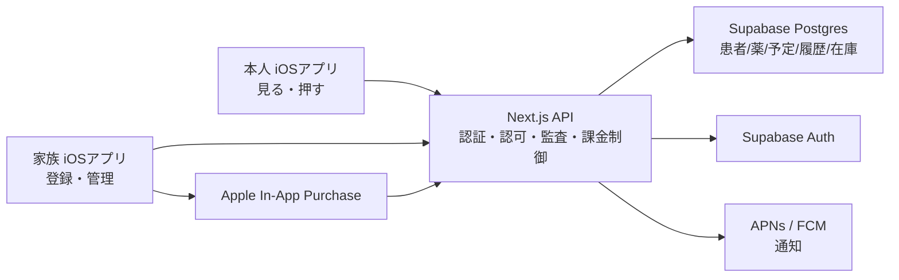
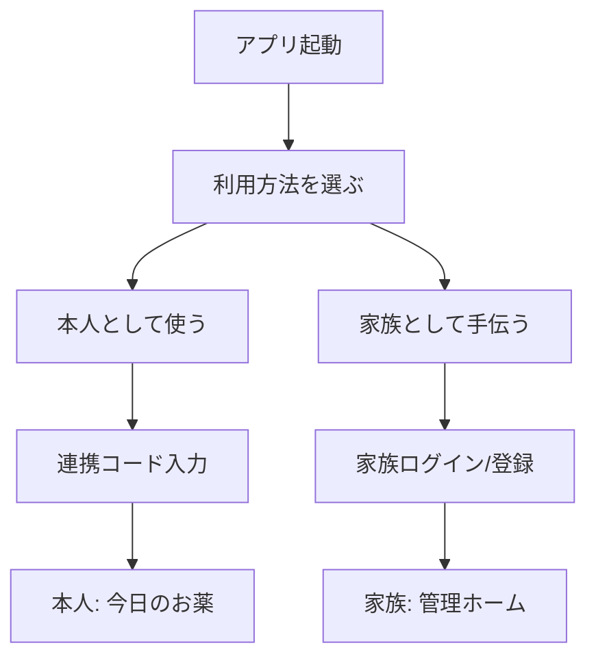
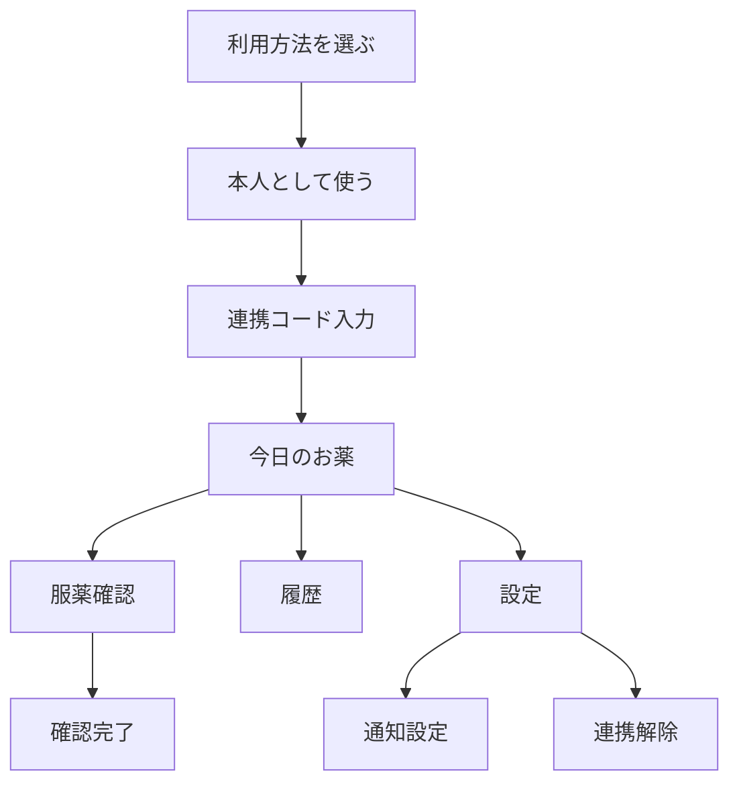
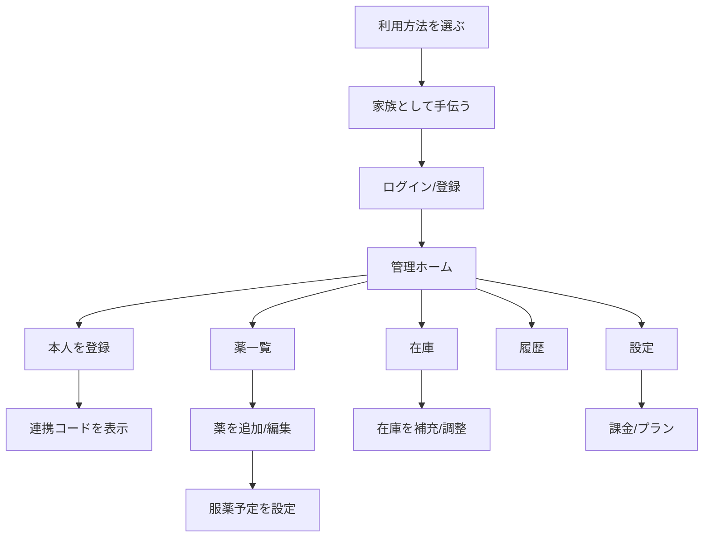

# Initial Public Release Design

**Created**: 2026-06-06  
**Status**: Draft  
**Target**: iOS first public release  
**Product Direction**: Family-managed medication adherence app for elderly users

## 目的

初回公開版は、高齢の本人が薬の登録や在庫管理を自力で行う前提ではなく、家族が薬・予定・在庫を管理し、本人は毎日の服薬確認だけを簡単に行える構成で公開する。

この設計書は、App Store初回公開に向けた最小の本番設計、画面遷移、画面UI方針、課金方針、今後のスケーリング方針を定義する。

## 結論

- iOSアプリは1つに統一し、起動時に「本人として使う」「家族として手伝う」を選べる。
- 本人モードは無料で、服薬確認に必要な操作だけを提供する。
- 家族モードは薬登録、予定管理、在庫管理、履歴確認、連携コード発行を担当する。
- APIは残す。iOSからSupabaseへ直接すべてを書き込む構成にはしない。
- DBはSupabase Postgresを使い、Next.js APIで認証、認可、監査、課金制御、将来のAndroid対応を吸収する。
- 初回公開版でも「最小の本番設計」で出す。特に認証、認可、削除、プライバシー、監査の土台は最初から入れる。

## 対象ユーザー

### 本人

- 高齢者または薬の自己管理が難しい人。
- 毎日アプリを開いて「飲みました」を押す。
- 薬の登録、スケジュール設定、在庫調整は原則行わない。

### 家族

- 本人の薬と服薬予定を代わりに管理する人。
- 薬の追加、編集、在庫補充、低在庫確認、服薬履歴確認を行う。
- 本人の端末に連携コードを入力してもらい、本人モードを有効化する。

### 将来の関係者

- 別の家族、介護者、医療者、施設スタッフは将来フェーズで扱う。
- 初回公開版では医療者向けワークフローや診断・投薬助言は扱わない。

## 初回公開版の機能範囲

### 本人モード

必須:

- 連携コード入力
- 今日の薬一覧
- 服薬予定ごとの「飲みました」
- 「あとで知らせる」
- 今日の状態表示
- 簡単な履歴表示
- 通知設定
- 文字サイズ、見やすさに配慮した設定
- アカウント/連携解除に関する導線

含めない:

- 薬の新規登録
- 薬の編集
- 在庫数の直接編集
- 課金導線
- 複雑な統計
- 医療的助言

### 家族モード

必須:

- 家族アカウント登録/ログイン
- 本人情報の登録
- 本人連携コードの発行
- 薬の登録、編集、停止
- 服薬スケジュール設定
- 在庫数、残量、補充の管理
- 低在庫表示
- 今日の服薬状況確認
- 履歴確認
- 本人連携の解除
- アカウント削除、データ削除の導線

初回では最小化:

- 複数家族の詳細権限
- 医療者共有
- 施設管理
- Android
- 自動薬剤データベース連携
- AIによる服薬アドバイス

## システム構成

### APIを残す理由

- 患者データを扱うため、クライアントだけに認可判断を置かない。
- 将来Androidを出すときに、iOSとAndroidで同じAPIを使える。
- 課金状態、無料枠制限、履歴保持、PDF出力、通知、監査ログをサーバー側で一貫して制御できる。
- Supabase RLSは防御層として使い、ビジネスルールの中心はAPIに置く。

## 権限モデル

### 内部ロール

- `patient`: 本人。閲覧と服薬記録が中心。
- `caregiver`: 家族。作成、編集、管理の主体。

### 表示上の呼び方

- UIでは `patient` を「本人」または登録名で表示する。
- UIでは `caregiver` を「家族」と表示する。
- 高齢者向け画面では、専門用語や英語ロール名を出さない。

## セッション保持

- 本人モード / 家族モードは、一度選択すると次回起動時に自動復元する。
- セッション保持期間は最終ログイン、連携、またはトークン更新から30日とする。
- 家族トークン、家族refresh token、本人トークン、セッション期限はKeychainに保存する。
- `lastAppMode` と `currentPatientId` は機密情報ではないためUserDefaultsに保存する。
- 旧バージョンでUserDefaultsに保存されたトークンは、初回起動時にKeychainへ移行し、移行後にUserDefaults側から削除する。
- セッション期限切れ時はトークンだけを破棄し、最後に選んだモードは残す。家族はログイン画面、本人は連携コード画面へ戻す。
- ログアウトは該当モードのトークンと期限を削除する。
- 「利用方法を変更」はトークンを削除せず、モード選択画面へ戻す。

## 画面遷移

### 本人モード

### 家族モード

## 画面UI方針

### 共通

- 1画面1主目的にする。
- 主要ボタンは44pt以上、可能なら高齢者向けにさらに大きくする。
- 文字はDynamic Typeに対応する。
- 色だけで状態を伝えず、ラベルも併用する。
- エラー時は「何が起きたか」より「次に何をすればよいか」を優先して表示する。
- 複雑な表現を避け、「今日」「飲みました」「あとで知らせる」「家族に確認」などの自然な文言を使う。

### 本人向けUI

画面: 今日のお薬

- 上部: 「今日のお薬」
- サブ表示: 日付と現在の状態
- 中央: 服薬カードを時間帯ごとに表示
- カード内:
  - 薬名
  - 飲む時間
  - 錠数または用量
  - 大きな「飲みました」ボタン
  - 小さめの「あとで知らせる」ボタン
- 下部タブ:
  - 今日
  - 履歴
  - 設定

画面: 履歴

- カレンダーや細かい分析より、まず「飲めた日」「確認が必要な日」が分かることを優先する。
- 本人には詳細な在庫や課金情報を出さない。

画面: 設定

- 通知
- 文字の大きさ
- 家族との連携
- サポート/問い合わせ
- プライバシー

### 家族向けUI

画面: 管理ホーム

- 上部: 管理中の本人名
- 今日の服薬状況
- 確認が必要な予定
- 在庫が少ない薬
- 次の操作:
  - 薬を追加
  - 在庫を補充
  - 連携コードを見せる

画面: 薬管理

- 薬一覧
- 薬の追加/編集
- 用量、服薬時間、曜日、開始日、終了日
- 停止済みの薬は履歴保護のため削除ではなく停止扱いを基本にする。

画面: 在庫

- 薬ごとの残量
- 1回あたり消費量
- 低在庫ライン
- 補充ボタン
- 在庫履歴

## 課金方針

### 基本方針

- 課金対象は家族モードに限定する。
- 本人モードの服薬確認は無料のまま維持する。
- 安全に関わる基本機能を課金で止めない。

### 無料プラン

無料で提供:

- 本人1人まで
- 薬5件まで
- 今日の薬表示
- 服薬記録
- ローカル通知
- 短期間の履歴
- 家族による基本管理
- 本人連携

### 有料プラン

名称案: ファミリープラス

価格案:

- 月額: 480円
- 年額: 4,800円

解放する機能:

- 薬登録数の上限緩和
- 複数の本人管理
- 追加の家族メンバー
- 在庫管理の強化
- 低在庫通知
- 長期履歴
- 月次レポート
- PDF出力
- 家族への未服薬通知

課金しないもの:

- 本人の「飲みました」
- 基本通知
- アカウント削除
- データ削除
- プライバシー関連操作
- 連携解除

## 初回公開版と現在の実装との差分

現在の実装は、すでに家族/本人の2モード、連携コード、薬管理、服薬記録、履歴、在庫、通知、課金基盤に近い構造を持つ。

初回公開版に向けた主な差分は、機能追加よりも公開スコープの整理とUIの簡略化である。

### 近い点

- iOSは1アプリで家族モード/本人モードを切り替える構成。
- 患者データは家族が作成し、本人は連携コードでアクセスする。
- 薬登録は家族側で行う。
- 本人側は今日の薬、履歴、設定を中心に使う。
- APIを介して認証・認可を行う。
- 在庫管理、履歴、通知、課金ゲートの土台が存在する。

### 整えるべき点

- UI文言を「Caregiver/Patient」から「家族/本人」に寄せる。
- 本人画面から管理・課金・複雑な設定を排除する。
- 高齢者向けにボタン、文字、余白、状態表示を調整する。
- 初回公開で見せる機能を絞り、未完成または複雑な機能は隠す。
- アカウント削除、データ削除、利用規約、プライバシーポリシーをApp Store提出前に確認する。
- 医療的助言に見える表現を避ける。
- 患者データを扱う前提でログ、監査、権限テスト、機微情報の取り扱いを確認する。

## 本番公開の最低条件

### App Store提出前

- Apple Developer Program登録
- Bundle ID、署名、App Store Connect設定
- App Privacy入力
- 利用規約、プライバシーポリシー
- アカウント削除導線
- サポート連絡先
- 通知許可文言
- 課金する場合はIn-App Purchase設定

### 技術

- 本番Supabaseプロジェクト
- 本番API環境
- 本番環境変数管理
- DBバックアップ方針
- 認証/認可テスト
- 監査ログまたは重要イベントログ
- エラー監視
- 個人情報・健康関連データをログに出さない設定

### 運用

- 問い合わせ対応フロー
- データ削除依頼対応
- 障害時の連絡方針
- 課金トラブル対応
- リリース前チェックリスト

## スケーリング方針

### Phase 1: iOS初回公開

目的:

- 家族が管理し、本人が押すだけの服薬管理を成立させる。

範囲:

- iOSのみ
- 家族1人
- 本人1人
- 基本的な薬、予定、在庫、履歴、通知
- 無料プランとファミリープラス

### Phase 2: 家族内共有

目的:

- 複数の家族で本人を支える。

追加:

- 家族メンバー招待
- 管理者/閲覧者ロール
- 家族への未服薬通知
- 変更履歴
- 連携解除と権限変更

### Phase 3: Android対応

目的:

- 同じAPIとDBを使い、Android版を追加する。

追加:

- API契約のOpenAPI整備
- Androidクライアント
- FCM通知
- iOS/Androidで同じ権限モデル
- 課金方式の差異吸収

### Phase 4: 医療者・介護者共有

目的:

- 本人または家族の同意に基づき、記録を外部関係者へ共有する。

追加:

- 共有同意
- 共有期限
- 閲覧専用アクセス
- PDF/レポート共有
- 監査ログ強化

この段階でも、診断、処方変更、薬学的助言はアプリの責任範囲に入れない。

### Phase 5: 施設・法人対応

目的:

- 介護施設、薬局、医療機関など複数患者を扱う組織に対応する。

追加:

- 組織アカウント
- スタッフ管理
- 患者一覧
- RBAC
- 監査ログ
- SLA/バックアップ/契約管理
- コンプライアンス対応

## 非機能要件

### セキュリティ

- deny-by-defaultで認可する。
- 本人は自分に連携されたpatientIdだけにアクセスできる。
- 家族は自分が管理権限を持つpatientIdだけにアクセスできる。
- トークン、氏名、薬名、健康情報を不要にログ出力しない。
- 重要操作はイベントとして追跡できるようにする。

### プライバシー

- 患者データを機微情報として扱う。
- App Storeのプライバシー申告と実装を一致させる。
- データ削除と連携解除をユーザーが理解できる形で提供する。

### アクセシビリティ

- Dynamic Type対応
- VoiceOverラベル
- 十分なコントラスト
- 大きなタップ領域
- 認知負荷の低い画面構成

### 信頼性

- 服薬記録の二重送信を防ぐ。
- 通信失敗時は再試行できる。
- 通知だけに依存せず、アプリを開けば今日の状態を確認できる。
- サーバー側の課金・権限制御を必ず通す。

## 成功基準

- 本人が初回説明なしでも今日の薬を確認し、「飲みました」を押せる。
- 家族が薬を登録し、本人と連携し、服薬状況を確認できる。
- 本人モードに課金導線や管理機能が表示されない。
- 家族モードで無料/有料の違いが明確に伝わる。
- 認可テストで他人のpatientIdにアクセスできない。
- App Store審査に必要なプライバシー、削除、課金、サポート情報が揃っている。
